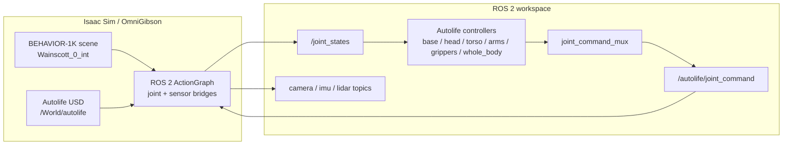
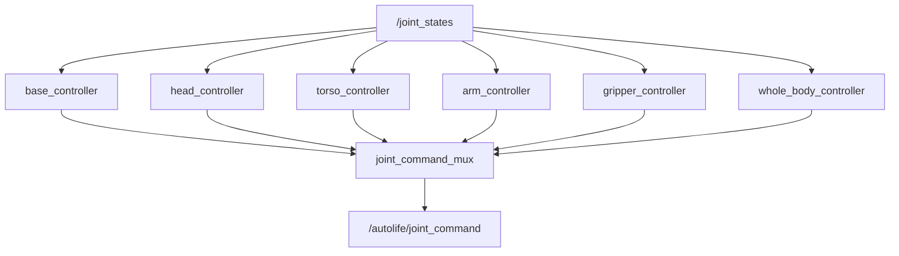

# Autolife Sim

[中文说明](README.zh-CN.md)


Autolife Sim is a ROS 2 and Isaac Sim workspace for running the Autolife robot in realistic household environments. The current simulation path loads a BEHAVIOR-1K / OmniGibson interactive scene, inserts the Autolife robot USD, creates ROS 2 bridges for joints and sensors, and drives the robot with ROS 2 controller nodes.

The main validated scene is `Wainscott_0_int`.

## Overview

This repository contains the Autolife-side integration code and robot assets:

- Autolife robot description, URDF/Xacro, meshes, and USD assets.
- ROS 2 controller nodes for base, torso, head, arms, grippers, and whole-body commands.
- A joint command mux that merges controller outputs into one Isaac-side joint command topic.
- Isaac Sim / OmniGibson scripts for loading BEHAVIOR scenes and inserting Autolife.
- ROS 2 bridge setup for joint states, joint commands, cameras, IMU, LiDAR, and TF.
- Runtime controller test scripts for checking commands against observed `/joint_states`.

This repository does not redistribute BEHAVIOR-1K scene/object assets, the BEHAVIOR dataset key, Isaac Sim, or a Conda environment.

## Architecture



The controller stack is intentionally ROS-native. Isaac Sim publishes the current robot state to `/joint_states`; ROS 2 controllers publish partial joint commands; `joint_command_mux` resolves them into `/autolife/joint_command`; the Isaac-side ActionGraph applies the command to the simulated articulation.

## Repository Layout

```text
autolife_ws/
  README.md
  README.zh-CN.md
  src/
    asset/
      urdf/                         # Raw robot description assets
      usd/                          # Autolife USD assets committed with this repo
    autolife_description/           # ROS 2 robot description package
    autolife_control/               # ROS 2 controllers, mux, and runtime tests
    autolife_sensors/               # Sensor-side ROS 2 helpers
    autolife_simulation/            # Isaac Sim / OmniGibson integration scripts
    autolife_hardware/              # ros2_control hardware interface package
```

## External Dependencies

### Required

- Ubuntu with an NVIDIA GPU supported by Isaac Sim.
- ROS 2 Jazzy.
- NVIDIA Isaac Sim, installed through the BEHAVIOR / OmniGibson setup or otherwise available in the Python environment.
- BEHAVIOR-1K / OmniGibson source checkout.
- BEHAVIOR-1K assets downloaded through the official BEHAVIOR installer.
- A Conda environment for BEHAVIOR / OmniGibson, commonly named `behavior`.

### BEHAVIOR assets

BEHAVIOR-1K data must be installed by the user through the official BEHAVIOR workflow. The dataset license is separate from the OmniGibson software license, and BEHAVIOR scene/object assets are not redistributed by this repository.

The official `download_behavior_1k_assets()` path downloads the full `behavior-1k-assets` bundle. This project only uses `Wainscott_0_int` by default, but the official downloader is not a per-scene downloader. If a local single-scene cache is needed later, create it only from a legally installed BEHAVIOR dataset and do not commit or redistribute that cache.

## Setup

### 1. Install BEHAVIOR-1K / OmniGibson

Follow the official installation guide first:

- BEHAVIOR installation: https://behavior.stanford.edu/getting_started/installation.html
- BEHAVIOR GitHub: https://github.com/StanfordVL/BEHAVIOR-1K

Example, using the stable branch shown by the official documentation:

```bash
git clone -b v3.7.2 https://github.com/StanfordVL/BEHAVIOR-1K.git
cd BEHAVIOR-1K
./setup.sh --new-env --omnigibson --bddl --dataset
conda activate behavior
```

For non-interactive installation, read the official license prompts carefully before using auto-accept flags.

### 2. Build this ROS 2 workspace

```bash
cd autolife_ws
source /opt/ros/jazzy/setup.bash
rosdep install --from-paths src --ignore-src -r -y
colcon build --symlink-install
source install/setup.bash
```

### 3. Check the robot assets

Autolife USD assets are expected under:

```text
src/asset/usd/
```

These assets are small enough to keep in Git. Backup USD files such as `*.bak_*` and local scene backup folders should not be committed.

## Quick Start

Open separate terminals after building the workspace.

### Terminal 1: load BEHAVIOR scene with Autolife

```bash
cd autolife_ws
conda activate behavior
source /opt/ros/jazzy/setup.bash
source install/setup.bash

python3 src/autolife_simulation/scripts/load_behavior_scene_with_autolife.py \
  --scene-model Wainscott_0_int
```

Useful options:

- `--headless`: run without the Isaac Sim GUI.
- `--quick-load`: load only scene structure categories for faster smoke tests. Do not use this for object interaction tests because regular scene objects are skipped.
- `--steps 0`: load the stage and exit without advancing simulation.
- `--steps -1`: run until interrupted. This is the default, so it can be omitted for normal interactive use.
- `--no-ros2-bridge`: load the scene without joint ROS 2 bridge.
- `--no-ros2-sensors`: skip sensor bridge graph creation.
- `--sensor-manifest-path`: runtime JSON manifest for sensor tests. The default is `/tmp/autolife_sensor_manifest.json`.

### Terminal 2: launch ROS 2 controllers

```bash
cd autolife_ws
source /opt/ros/jazzy/setup.bash
source install/setup.bash

ros2 launch autolife_control controllers.launch.py
```

This starts:

- `joint_command_mux`
- `base_controller`
- `torso_controller`
- `head_controller`
- `arm_controller`
- `gripper_controller`
- `whole_body_controller`

### Terminal 3: run controller validation

```bash
cd autolife_ws
source /opt/ros/jazzy/setup.bash
source install/setup.bash

python3 src/autolife_control/test/controller_test_runner.py --interactive
```

Run a specific controller:

```bash
python3 src/autolife_control/test/controller_test_runner.py --controllers whole_body
```

The controller test reads `src/autolife_control/test/controller_test_config.yaml`. It supports absolute and delta targets. The script resets the robot at the beginning and end through the whole-body action interface.

### Terminal 4: run sensor validation

```bash
cd autolife_ws
source /opt/ros/jazzy/setup.bash
source install/setup.bash

python3 src/autolife_sensors/test/sensor_test_runner.py
```

The sensor test reads the runtime manifest emitted by the Isaac sensor bridge and verifies topic existence, message type, message content, `header.frame_id`, and TF availability. The default manifest path is `/tmp/autolife_sensor_manifest.json`.

### Terminal 5: inspect ROS 2 topics and RViz

```bash
ros2 topic list
ros2 topic echo /joint_states
ros2 topic echo /autolife/joint_command
ros2 topic list | grep /autolife/sensors
```

Open the preconfigured RViz sensor view:

```bash
rviz2 -d install/autolife_sensors/share/autolife_sensors/rviz/autolife_sensors.rviz
```

Sensor topics are created by the Isaac Sim sensor ActionGraph. The forehead camera publishes RGB, depth, point cloud, and camera info; the other cameras publish RGB and camera info by default.

## Control Interfaces



The whole-body controller exposes `/whole_body_controller/follow_joint_trajectory` and is used for coordinated whole-body targets and test reset. The mux gives whole-body commands the highest priority while they are fresh.

## Sensors

The simulation loader copies the sensor overlay authored in the Autolife USD/world assets, then creates ROS 2 bridge nodes for the discovered sensors.

Expected sensor categories:

- Cameras: RGB and camera info for all cameras.
- Forehead camera: RGB, depth, point cloud, and camera info.
- IMU: ROS 2 IMU message bridge.
- LiDAR: front and back point cloud bridges.
- TF: transform tree for robot and sensor frames.

Camera message frames use stable optical frame ids, such as `camera_head_forehead_optical_frame`. These optical frames are added under the camera prims and published through `/tf`, so point clouds can be transformed into `World` in RViz. LiDAR and IMU messages use their corresponding link frames, such as `Link_Lidar_Front` and `Link_IMU`.

Use `ros2 topic list` after the simulation is running to inspect the exact topic names created for the active stage. Use the sensor runtime test for stricter validation.

## Repository Scope

Autolife robot assets required by the examples are included under `src/asset/usd`. BEHAVIOR-1K scene/object assets, the BEHAVIOR dataset key, Isaac Sim, and Conda environments are external dependencies and are not redistributed by this repository. Install BEHAVIOR-1K assets through the official BEHAVIOR workflow before running the `Wainscott_0_int` scene.

## References

This project uses BEHAVIOR-1K / OmniGibson as an external simulation dependency.

- BEHAVIOR website: https://behavior.stanford.edu/
- BEHAVIOR installation guide: https://behavior.stanford.edu/getting_started/installation.html
- BEHAVIOR important concepts: https://behavior.stanford.edu/getting_started/important_concepts.html
- OmniGibson overview: https://behavior.stanford.edu/omnigibson/overview.html
- BEHAVIOR-1K GitHub: https://github.com/StanfordVL/BEHAVIOR-1K
- Custom robot import tutorial: https://behavior.stanford.edu/tutorials/custom_robot_import.html

If you use BEHAVIOR-1K / OmniGibson in research, cite the official BEHAVIOR-1K paper:

```bibtex
@article{li2024behavior1k,
    title   = {BEHAVIOR-1K: A Human-Centered, Embodied AI Benchmark with 1,000 Everyday Activities and Realistic Simulation},
    author  = {Chengshu Li and Ruohan Zhang and Josiah Wong and Cem Gokmen and Sanjana Srivastava and Roberto Martin-Martin and Chen Wang and Gabrael Levine and Wensi Ai and Benjamin Martinez and Hang Yin and Michael Lingelbach and Minjune Hwang and Ayano Hiranaka and Sujay Garlanka and Arman Aydin and Sharon Lee and Jiankai Sun and Mona Anvari and Manasi Sharma and Dhruva Bansal and Samuel Hunter and Kyu-Young Kim and Alan Lou and Caleb R Matthews and Ivan Villa-Renteria and Jerry Huayang Tang and Claire Tang and Fei Xia and Yunzhu Li and Silvio Savarese and Hyowon Gweon and C. Karen Liu and Jiajun Wu and Li Fei-Fei},
    journal = {arXiv preprint arXiv:2403.09227},
    year    = {2024}
}
```
