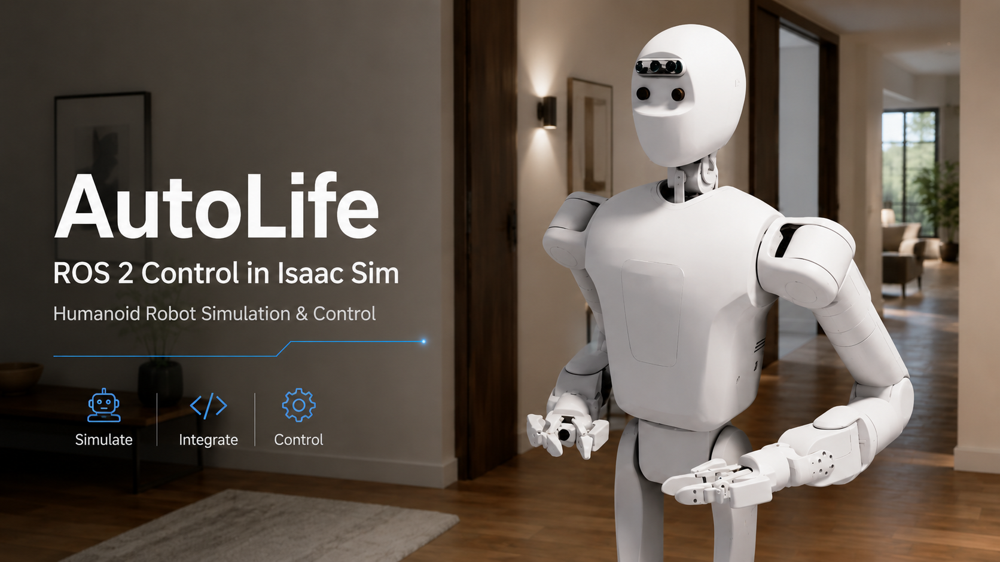
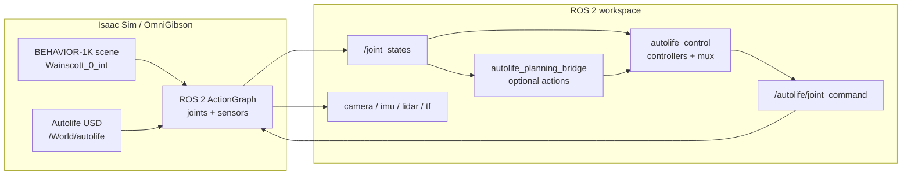

# Autolife Sim

[中文说明](README.zh-CN.md)


<p align="center">
  
</p>

Autolife Sim is a ROS 2 and Isaac Sim workspace for running the Autolife robot
in BEHAVIOR-1K / OmniGibson household scenes. The current validated scene is
`Wainscott_0_int`.

This workspace loads the Autolife USD robot into the scene, bridges joints and
sensors into ROS 2, runs ROS-native controllers, and optionally exposes
[Autolife-Planning](https://github.com/AdaCompNUS/Autolife-Planning) through ROS
2 actions.

## Overview



Isaac Sim publishes robot state to `/joint_states`. ROS 2 controllers publish
partial commands, `joint_command_mux` merges them into `/autolife/joint_command`,
and the Isaac-side ActionGraph applies that command to the simulated robot.

## Repository Layout

```text
autolife_ws/
  README.md
  README.zh-CN.md
  src/
    asset/                         # Autolife URDF, mesh, and USD assets
    autolife_description/          # ROS 2 robot description package
    autolife_control/              # Controllers, mux, and runtime tests
    autolife_planning_msgs/         # Planning action interfaces
    autolife_planning_bridge/       # Autolife-Planning ROS 2 action bridge
    autolife_sensors/              # Sensor naming, validation, and RViz config
    autolife_simulation/           # Isaac Sim / OmniGibson integration scripts
    autolife_hardware/             # ros2_control hardware interface package
```

Package documentation:

- [autolife_simulation](src/autolife_simulation/README.md): BEHAVIOR scene
  loading, robot insertion, joint bridge, and sensor bridge.
- [autolife_control](src/autolife_control/README.md): controller interfaces,
  command mux behavior, and controller runtime tests.
- [autolife_sensors](src/autolife_sensors/README.md): sensor topic naming,
  frame conventions, RViz config, and sensor validation.
- [autolife_planning_bridge](src/autolife_planning_bridge/README.md): optional
  Autolife-Planning integration and planning runtime tests.

## External Dependencies

Required externally:

- Ubuntu with an NVIDIA GPU supported by Isaac Sim.
- ROS 2 Jazzy.
- NVIDIA Isaac Sim, available in the Python environment used by OmniGibson.
- BEHAVIOR-1K / OmniGibson source checkout and downloaded assets.
- A BEHAVIOR / OmniGibson Conda environment, commonly named `behavior`.

This repository does not redistribute BEHAVIOR-1K scene/object assets, the
BEHAVIOR dataset key, Isaac Sim, or a Conda environment. Install BEHAVIOR-1K
through the official workflow:

- BEHAVIOR installation: https://behavior.stanford.edu/getting_started/installation.html
- BEHAVIOR GitHub: https://github.com/StanfordVL/BEHAVIOR-1K

## Build

```bash
cd autolife_ws
source /opt/ros/jazzy/setup.bash
rosdep install --from-paths src --ignore-src -r -y
colcon build --symlink-install
source install/setup.bash
```

Autolife robot USD assets are expected under:

```text
src/asset/usd/
```

## Quick Start

Open separate terminals after building the workspace.

Terminal 1: load the BEHAVIOR scene with Autolife:

```bash
cd autolife_ws
conda activate behavior
source /opt/ros/jazzy/setup.bash
source install/setup.bash

python3 src/autolife_simulation/scripts/load_behavior_scene_with_autolife.py \
  --scene-model Wainscott_0_int
```

Terminal 2: start the ROS 2 controllers:

```bash
cd autolife_ws
source /opt/ros/jazzy/setup.bash
source install/setup.bash

ros2 launch autolife_control controllers.launch.py
```

Terminal 3: run controller validation:

```bash
cd autolife_ws
source /opt/ros/jazzy/setup.bash
source install/setup.bash

python3 src/autolife_control/test/controller_test_runner.py --interactive
```

Terminal 4: run sensor validation:

```bash
cd autolife_ws
source /opt/ros/jazzy/setup.bash
source install/setup.bash

python3 src/autolife_sensors/test/sensor_test_runner.py
```

Inspect live topics:

```bash
ros2 topic list
ros2 topic echo /joint_states
ros2 topic echo /autolife/joint_command
ros2 topic list | grep /autolife/sensors
```

Open the RViz sensor view:

```bash
rviz2 -d install/autolife_sensors/share/autolife_sensors/rviz/autolife_sensors.rviz
```

## Optional Planning Bridge

After the simulator and controllers are running, launch the planning bridge:

```bash
cd autolife_ws
source /opt/ros/jazzy/setup.bash
source install/setup.bash

ros2 launch autolife_planning_bridge planning.launch.py
```

Run the planning runtime test:

```bash
python3 src/autolife_planning_bridge/test/planning_test_runner.py --interactive
```

The bridge exposes:

```text
/autolife_planning/joint_control
/autolife_planning/pose_control
/autolife_planning/trajectory_execution
```

See [src/autolife_planning_bridge/README.md](src/autolife_planning_bridge/README.md)
for the Autolife-Planning environment requirements and test configuration. The
planning bridge is built around
[AdaCompNUS/Autolife-Planning](https://github.com/AdaCompNUS/Autolife-Planning).

## Repository Scope

Autolife robot assets required by the examples are included under
`src/asset/usd`. Local backup USD files, generated caches, BEHAVIOR scene/object
assets, Isaac Sim, and Conda environments should not be committed.

External references:

- BEHAVIOR website: https://behavior.stanford.edu/
- OmniGibson overview: https://behavior.stanford.edu/omnigibson/overview.html
- Autolife-Planning: https://github.com/AdaCompNUS/Autolife-Planning

If you use BEHAVIOR-1K / OmniGibson in research, cite the official BEHAVIOR-1K
paper from the project website.
