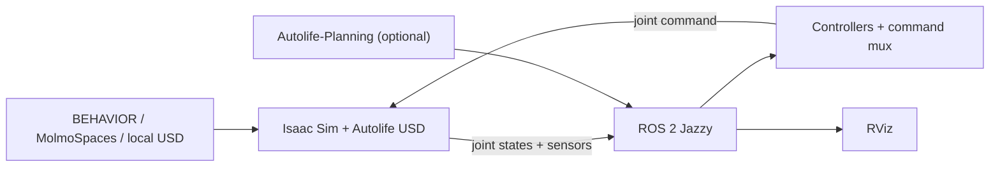

# Autolife_Sim

[简体中文](README.zh-CN.md)


<p align="center">
  
</p>

Autolife_Sim is the ROS 2 and Isaac Sim workspace for the Autolife robot. It
loads the robot into BEHAVIOR-1K, MolmoSpaces, or a minimal desk scene and
connects simulation joints and sensors to ROS 2 controllers, RViz, and the
optional Autolife-Planning stack.

## Features

- A single simulator entry point for BEHAVIOR, MolmoSpaces, and local USD
  scenes.
- ROS 2 joint-state, joint-command, camera, LiDAR, IMU, and TF bridges.
- ROS-native controllers with command arbitration and runtime checks.
- Optional ROS 2 actions backed by Autolife-Planning.

## Architecture



The simulator runs in Python 3.11. Controllers and RViz run in the system ROS
2 Jazzy environment (Python 3.12) and communicate with Isaac Sim through DDS.

## Requirements

| Component | Validated version |
| --- | --- |
| Ubuntu | 24.04 |
| ROS 2 | Jazzy |
| Python in the simulator environment | 3.11 |
| Isaac Sim | 5.1.0 |
| OmniGibson | 3.8.0 |
| BDDL | 3.7.0 |
| BEHAVIOR-1K | commit `8579326f8a9719fe7a261f69ab0f27d545ac38a9` |
| MolmoSpaces resource manager | `0.0.1b4` |

An NVIDIA GPU supported by Isaac Sim, Git, and Conda are required. BEHAVIOR
and MolmoSpaces datasets are downloaded separately and are not committed to
this repository.

## Installation

Clone the repository. The directory name below is only a convention; scripts
discover the repository root from their own location.

```bash
git clone https://github.com/Jiaxuan0Lin/Autolife_Sim.git
cd Autolife_Sim
```

Create the unified simulator environment:

```bash
scripts/setup_autolife_sim_env.sh
```

The script checks out the validated BEHAVIOR-1K revision
under `.deps/BEHAVIOR-1K`, invokes its official installer, and applies the
pinned MolmoSpaces overlay from `requirements/autolife_sim.txt`. A legacy
environment is used only when explicitly selected, which keeps the default
installation deterministic. To migrate an existing environment:

```bash
AUTOLIFE_SIM_CLONE_FROM=my_existing_env scripts/setup_autolife_sim_env.sh
```

The upstream installer presents the NVIDIA and BEHAVIOR dataset licenses. See
the official [BEHAVIOR-1K installation guide](https://behavior.stanford.edu/getting_started/installation.html)
before accepting them. For a non-interactive installation after reviewing the
licenses, pass `--accept-licenses` to the setup script.

Build the ROS 2 workspace in a system-ROS terminal:

```bash
source /opt/ros/jazzy/setup.bash
rosdep install --from-paths src --ignore-src -r -y
colcon build --symlink-install
source install/setup.bash
```

Install the assets required by the configured MolmoSpaces scene:

```bash
source scripts/activate_autolife_sim.sh
python src/autolife_simulation/scripts/download_molmospace_scene.py
```

Downloaded data is cached under `.cache/molmospaces`; the stable asset view is
created under `src/asset/usd/molmospaces`. Both directories are resolved from
the repository root and can be overridden through command-line arguments.

## Quick Start

Use separate terminals for the simulator and system ROS 2.

### 1. Start the simulator

```bash
source scripts/activate_autolife_sim.sh
python src/autolife_simulation/scripts/start_autolife_simulation.py \
  --scene-model molmospace_scene \
  --steps -1
```

Select the scene with `--scene-model`:

| Value | Scene source |
| --- | --- |
| `molmospace_scene` | Configured MolmoSpaces scene |
| `desk` | Local desk scene |
| `Wainscott_0_int` or another model name | BEHAVIOR-1K scene through OmniGibson |

Use `--headless` for server execution and `--help` for all launcher options.

### 2. Start ROS 2 controllers

```bash
source /opt/ros/jazzy/setup.bash
source install/setup.bash
ros2 launch autolife_control controllers.launch.py
```

### 3. Inspect sensors

```bash
source /opt/ros/jazzy/setup.bash
source install/setup.bash
rviz2 -d install/autolife_sensors/share/autolife_sensors/rviz/autolife_sensors.rviz
```

Runtime checks are available when needed:

```bash
python3 src/autolife_control/test/controller_test_runner.py --interactive
python3 src/autolife_sensors/test/sensor_test_runner.py
```

## Optional Planning Bridge

Autolife-Planning remains a separate optional environment because it uses
native planning extensions and the system ROS Python ABI. With its environment
active, launch the bridge after the simulator and controllers:

```bash
source /opt/ros/jazzy/setup.bash
source install/setup.bash
ros2 launch autolife_planning_bridge planning.launch.py
```

Set `AUTOLIFE_PLANNING_ROOT`, `AUTOLIFE_PLANNING_PYTHON_SITE`, or
`AUTOLIFE_PLANNING_PYTHON` only when the planner is not installed in the active
environment. See the [planning bridge documentation](src/autolife_planning_bridge/README.md).

## Configuration

| File | Purpose |
| --- | --- |
| `src/autolife_simulation/config/molmospace_scene.json` | MolmoSpaces asset, spawn, physics, and interaction settings |
| `src/autolife_simulation/config/desk.json` | Local desk scene settings |
| `src/autolife_simulation/config/autolife.json` | Robot drive and control configuration |
| `src/autolife_control/launch/controllers.launch.py` | ROS 2 controller launch configuration |
| `src/autolife_sensors/test/sensor_test_config.yaml` | Sensor runtime validation settings |

Project-local generated data lives in `.deps/`, `.cache/`, `build/`, `install/`,
and `log/`; these paths are ignored by Git.

## Repository Layout

```text
Autolife_Sim/
├── requirements/                 # Pinned simulator overlay
├── scripts/                      # Environment setup and activation
├── src/
│   ├── asset/                    # Robot, sensor, and local scene assets
│   ├── autolife_description/     # URDF/Xacro and visualization
│   ├── autolife_control/         # Controllers and command mux
│   ├── autolife_hardware/        # ros2_control hardware interface
│   ├── autolife_planning_bridge/ # Optional planning actions
│   ├── autolife_planning_msgs/   # Planning action definitions
│   ├── autolife_sensors/         # Sensor bridge validation and RViz
│   └── autolife_simulation/      # Isaac Sim/OmniGibson integration
└── README.zh-CN.md
```

Package-level interfaces are documented in
[autolife_simulation](src/autolife_simulation/README.md),
[autolife_control](src/autolife_control/README.md), and
[autolife_sensors](src/autolife_sensors/README.md).

## License and Upstream Projects

This repository is licensed under the [Apache License 2.0](LICENSE). External
simulators, datasets, and assets retain their own licenses:

- [NVIDIA Isaac Sim](https://docs.isaacsim.omniverse.nvidia.com/)
- [BEHAVIOR-1K / OmniGibson](https://github.com/StanfordVL/BEHAVIOR-1K)
- [MolmoSpaces](https://github.com/allenai/molmospaces)
- [Autolife-Planning](https://github.com/AdaCompNUS/Autolife-Planning)
