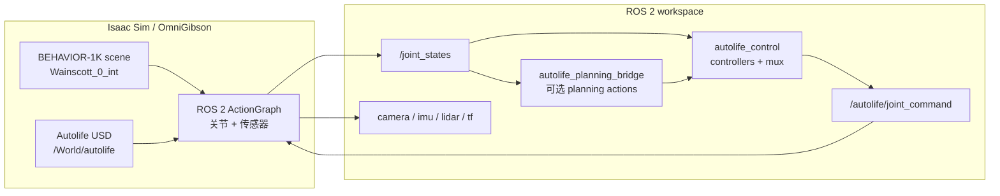

# Autolife Sim

[English README](README.md)


Autolife Sim 是一个面向 Autolife 机器人的 ROS 2 + Isaac Sim 仿真工作空间。
当前主要验证场景是 `Wainscott_0_int`。

这个 workspace 会把 Autolife USD 机器人加载到 BEHAVIOR-1K / OmniGibson
家庭场景中，把关节和传感器桥接到 ROS 2，运行 ROS-native controllers，并可选
通过 ROS 2 actions 接入
[Autolife-Planning](https://github.com/AdaCompNUS/Autolife-Planning)。

## 项目概览



Isaac Sim 发布机器人状态到 `/joint_states`；ROS 2 controllers 发布各自的局部
命令；`joint_command_mux` 合并成 `/autolife/joint_command`；Isaac 侧
ActionGraph 再把命令作用到仿真机器人上。

## 仓库结构

```text
autolife_ws/
  README.md
  README.zh-CN.md
  src/
    asset/                         # Autolife URDF、mesh 和 USD 资产
    autolife_description/          # ROS 2 robot description 包
    autolife_control/              # Controllers、mux 和运行时测试
    autolife_planning_msgs/         # Planning action 接口
    autolife_planning_bridge/       # Autolife-Planning ROS 2 action bridge
    autolife_sensors/              # 传感器命名、验证和 RViz 配置
    autolife_simulation/           # Isaac Sim / OmniGibson 集成脚本
    autolife_hardware/             # ros2_control hardware interface 包
```

子包文档：

- [autolife_simulation](src/autolife_simulation/README.md)：BEHAVIOR 场景加载、
  机器人插入、关节桥接和传感器桥接。
- [autolife_control](src/autolife_control/README.md)：controller 接口、
  command mux 行为和 controller 运行时测试。
- [autolife_sensors](src/autolife_sensors/README.md)：sensor topic 命名、
  frame 约定、RViz 配置和 sensor 验证。
- [autolife_planning_bridge](src/autolife_planning_bridge/README.md)：可选
  Autolife-Planning 集成和 planning 运行时测试。

## 外部依赖

必需环境：

- 带 NVIDIA GPU 的 Ubuntu 机器，GPU 需要满足 Isaac Sim 要求。
- ROS 2 Jazzy。
- 当前 Python 环境能访问 NVIDIA Isaac Sim。
- BEHAVIOR-1K / OmniGibson 源码和已下载的 assets。
- BEHAVIOR / OmniGibson 对应的 Conda 环境，常用环境名是 `behavior`。

这个仓库不分发 BEHAVIOR-1K 场景/物体数据、BEHAVIOR dataset key、Isaac Sim，
也不包含 Conda 环境。请通过官方流程安装 BEHAVIOR-1K：

- BEHAVIOR installation: https://behavior.stanford.edu/getting_started/installation.html
- BEHAVIOR GitHub: https://github.com/StanfordVL/BEHAVIOR-1K

## 编译

```bash
cd autolife_ws
source /opt/ros/jazzy/setup.bash
rosdep install --from-paths src --ignore-src -r -y
colcon build --symlink-install
source install/setup.bash
```

Autolife 机器人 USD 资产应位于：

```text
src/asset/usd/
```

## 快速启动

编译完成后，打开多个终端分别运行。

终端 1：加载 BEHAVIOR 场景和 Autolife：

```bash
cd autolife_ws
conda activate behavior
source /opt/ros/jazzy/setup.bash
source install/setup.bash

python3 src/autolife_simulation/scripts/load_behavior_scene_with_autolife.py \
  --scene-model Wainscott_0_int
```

终端 2：启动 ROS 2 controllers：

```bash
cd autolife_ws
source /opt/ros/jazzy/setup.bash
source install/setup.bash

ros2 launch autolife_control controllers.launch.py
```

终端 3：运行 controller 验证：

```bash
cd autolife_ws
source /opt/ros/jazzy/setup.bash
source install/setup.bash

python3 src/autolife_control/test/controller_test_runner.py --interactive
```

终端 4：运行 sensor 验证：

```bash
cd autolife_ws
source /opt/ros/jazzy/setup.bash
source install/setup.bash

python3 src/autolife_sensors/test/sensor_test_runner.py
```

查看运行中的 ROS 2 topics：

```bash
ros2 topic list
ros2 topic echo /joint_states
ros2 topic echo /autolife/joint_command
ros2 topic list | grep /autolife/sensors
```

打开预置 RViz sensor 视图：

```bash
rviz2 -d install/autolife_sensors/share/autolife_sensors/rviz/autolife_sensors.rviz
```

## 可选 Planning Bridge

仿真和 controllers 都启动后，再启动 planning bridge：

```bash
cd autolife_ws
source /opt/ros/jazzy/setup.bash
source install/setup.bash

ros2 launch autolife_planning_bridge planning.launch.py
```

运行 planning runtime test：

```bash
python3 src/autolife_planning_bridge/test/planning_test_runner.py --interactive
```

bridge 暴露：

```text
/autolife_planning/joint_control
/autolife_planning/pose_control
/autolife_planning/trajectory_execution
```

Autolife-Planning 环境要求和测试配置见
[src/autolife_planning_bridge/README.md](src/autolife_planning_bridge/README.md)。
planning bridge 基于
[AdaCompNUS/Autolife-Planning](https://github.com/AdaCompNUS/Autolife-Planning)
集成。

## 仓库范围

示例运行所需的 Autolife 机器人资产包含在 `src/asset/usd`。本地 USD 备份、
生成缓存、BEHAVIOR 场景/物体资产、Isaac Sim 和 Conda 环境都不应提交。

外部参考：

- BEHAVIOR website: https://behavior.stanford.edu/
- OmniGibson overview: https://behavior.stanford.edu/omnigibson/overview.html
- Autolife-Planning: https://github.com/AdaCompNUS/Autolife-Planning

如果在研究中使用 BEHAVIOR-1K / OmniGibson，请引用项目官网提供的官方
BEHAVIOR-1K 论文。
