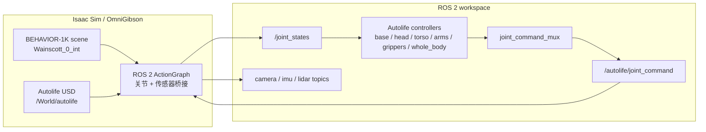
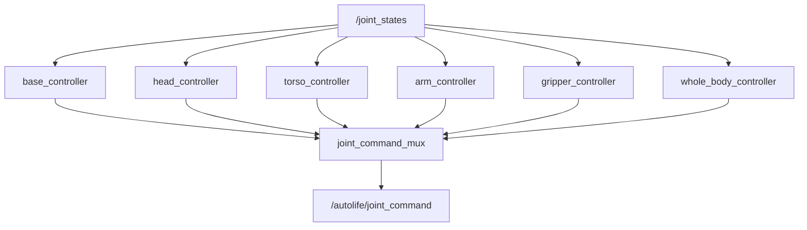

# Autolife Sim

[English README](README.md)

Autolife Sim 是一个面向 Autolife 机器人的 ROS 2 + Isaac Sim 仿真工作空间。当前主流程是在 BEHAVIOR-1K / OmniGibson 的交互式家庭场景中加载 Autolife 机器人 USD，然后通过 Isaac Sim ActionGraph 建立 ROS 2 的关节和传感器桥接，最后使用 ROS 2 controller 栈控制机器人。

当前主要验证场景是 `Wainscott_0_int`。

## 项目概览

这个仓库包含 Autolife 侧的集成代码和机器人资产：

- Autolife 机器人描述、URDF/Xacro、mesh 和 USD 资产。
- ROS 2 controller：底盘、躯干、头部、双臂、夹爪、whole-body。
- `joint_command_mux`：把多个 controller 的输出合并成 Isaac 侧统一关节命令。
- Isaac Sim / OmniGibson 脚本：加载 BEHAVIOR 场景并插入 Autolife。
- ROS 2 bridge：关节状态、关节命令、相机、IMU、LiDAR、TF。
- controller 运行时测试脚本：发送命令并通过 `/joint_states` 验证实际运动。

这个仓库不分发 BEHAVIOR-1K 场景/物体数据、BEHAVIOR 数据集 key、Isaac Sim 安装目录，也不包含 Conda 环境。

## 系统架构



控制链路是 ROS-native 的：Isaac Sim 发布当前机器人状态到 `/joint_states`；ROS 2 controllers 发布各自负责的局部关节命令；`joint_command_mux` 合并后输出 `/autolife/joint_command`；Isaac 侧 ActionGraph 再把这个命令作用到仿真 articulation 上。

## 仓库结构

```text
autolife_ws/
  README.md
  README.zh-CN.md
  src/
    asset/
      urdf/                         # 原始机器人描述资产
      usd/                          # 随仓库提交的 Autolife USD 资产
    autolife_description/           # ROS 2 机器人描述包
    autolife_control/               # ROS 2 controllers、mux 和运行时测试
    autolife_sensors/               # 传感器侧 ROS 2 工具
    autolife_simulation/            # Isaac Sim / OmniGibson 集成脚本
    autolife_hardware/              # ros2_control hardware interface 包
```

## 外部依赖

### 必需环境

- 带 NVIDIA GPU 的 Ubuntu 机器，GPU 需要满足 Isaac Sim 要求。
- ROS 2 Jazzy。
- NVIDIA Isaac Sim，可以通过 BEHAVIOR / OmniGibson 官方安装流程安装，也可以保证当前 Python 环境能访问 Isaac Sim。
- BEHAVIOR-1K / OmniGibson 源码。
- 通过官方 BEHAVIOR 安装流程下载的 BEHAVIOR-1K assets。
- BEHAVIOR / OmniGibson 对应的 Conda 环境，常用环境名是 `behavior`。

### BEHAVIOR 资产

BEHAVIOR-1K 数据必须由用户自己通过官方流程安装。BEHAVIOR dataset license 和 OmniGibson 软件 license 是独立的；这个仓库不重新分发 BEHAVIOR 的 scene/object assets。

官方 `download_behavior_1k_assets()` 路径下载的是完整 `behavior-1k-assets` 数据包。本项目默认只使用 `Wainscott_0_int`，但官方 downloader 不是按单个 scene 下载的接口。后续如果要做本地单场景缓存，只能在用户已经合法安装完整 BEHAVIOR 数据集之后，在本机裁剪使用，不能把裁剪后的 BEHAVIOR 数据提交或重新分发到 GitHub。

## 安装

### 1. 安装 BEHAVIOR-1K / OmniGibson

先按照官方安装文档完成 BEHAVIOR 环境：

- BEHAVIOR installation: https://behavior.stanford.edu/getting_started/installation.html
- BEHAVIOR GitHub: https://github.com/StanfordVL/BEHAVIOR-1K

示例，使用官方文档中的 stable branch：

```bash
git clone -b v3.7.2 https://github.com/StanfordVL/BEHAVIOR-1K.git
cd BEHAVIOR-1K
./setup.sh --new-env --omnigibson --bddl --dataset
conda activate behavior
```

如果使用非交互安装参数，请先认真阅读官方 license prompt，再使用自动接受参数。

### 2. 编译本 ROS 2 workspace

```bash
cd autolife_ws
source /opt/ros/jazzy/setup.bash
rosdep install --from-paths src --ignore-src -r -y
colcon build --symlink-install
source install/setup.bash
```

### 3. 检查机器人资产

Autolife USD 资产应位于：

```text
src/asset/usd/
```

这些机器人 USD 资产体积不大，可以随 GitHub 仓库提交。`*.bak_*`、`world_bak/` 这类本地备份不建议提交。

## 快速启动

编译完成后，打开多个终端分别运行。

### 终端 1：加载 BEHAVIOR 场景和 Autolife

```bash
cd autolife_ws
conda activate behavior
source /opt/ros/jazzy/setup.bash
source install/setup.bash

python src/autolife_simulation/scripts/load_behavior_scene_with_autolife.py \
  --scene-model Wainscott_0_int \
  --quick-load \
  --steps -1
```

常用参数：

- `--headless`：无 GUI 运行 Isaac Sim。
- `--quick-load`：使用 OmniGibson quick loading，加快启动。
- `--steps 0`：只加载 stage，不推进仿真。
- `--steps -1`：一直运行，直到手动中断。
- `--no-ros2-bridge`：只加载场景，不创建关节 ROS 2 bridge。
- `--no-ros2-sensors`：跳过传感器 bridge graph。

### 终端 2：启动 ROS 2 controllers

```bash
cd autolife_ws
source /opt/ros/jazzy/setup.bash
source install/setup.bash

ros2 launch autolife_control controllers.launch.py
```

这个 launch 会启动：

- `joint_command_mux`
- `base_controller`
- `torso_controller`
- `head_controller`
- `arm_controller`
- `gripper_controller`
- `whole_body_controller`

### 终端 3：运行 controller 验证

```bash
cd autolife_ws
source /opt/ros/jazzy/setup.bash
source install/setup.bash

python src/autolife_control/test/controller_test_runner.py --interactive
```

只测试某个 controller：

```bash
python src/autolife_control/test/controller_test_runner.py --controllers whole_body
```

测试配置来自 `src/autolife_control/test/controller_test_config.yaml`，支持 absolute 和 delta target。脚本开始和结束时会通过 whole-body action 接口把机器人 reset 回 0 位。

### 终端 4：查看 ROS 2 topic

```bash
ros2 topic list
ros2 topic echo /joint_states
ros2 topic echo /autolife/joint_command
```

传感器 topic 由 Isaac Sim sensor ActionGraph 创建。默认情况下，forehead camera 发布 RGB、depth 和 point cloud，其他相机只发布 RGB。

## 控制接口



whole-body controller 暴露 `/whole_body_controller/follow_joint_trajectory`，用于协调 whole-body target 和测试脚本中的 reset。mux 会在 whole-body 命令仍然 fresh 的时候给它最高优先级。

## 传感器

仿真加载脚本会从 Autolife USD/world 资产中复制 sensor overlay，然后为发现到的 sensor 创建 ROS 2 bridge 节点。

预期传感器类型：

- Cameras：所有相机发布 RGB。
- Forehead camera：额外发布 RGB、depth、point cloud。
- IMU：发布 ROS 2 IMU message。
- LiDAR：发布 ROS 2 LiDAR message。
- TF：发布机器人和传感器 frame 的 transform tree。

仿真运行后，用 `ros2 topic list` 查看当前 stage 实际创建出来的 topic 名。

## 资产和 License 说明

`src/asset/usd` 下的 Autolife 机器人资产属于本仓库内容。BEHAVIOR-1K assets 是外部依赖，用户必须按 BEHAVIOR dataset license 自行下载。

不要提交：

- BEHAVIOR dataset assets。
- BEHAVIOR encryption key。
- Isaac Sim 安装文件。
- Conda 环境。
- 生成的 `build/`、`install/`、`log/`。
- 本地 USD 备份文件和场景缓存目录。

## References

本项目把 BEHAVIOR-1K / OmniGibson 作为外部仿真依赖使用。

- BEHAVIOR website: https://behavior.stanford.edu/
- BEHAVIOR installation guide: https://behavior.stanford.edu/getting_started/installation.html
- BEHAVIOR important concepts: https://behavior.stanford.edu/getting_started/important_concepts.html
- OmniGibson overview: https://behavior.stanford.edu/omnigibson/overview.html
- BEHAVIOR-1K GitHub: https://github.com/StanfordVL/BEHAVIOR-1K
- Custom robot import tutorial: https://behavior.stanford.edu/tutorials/custom_robot_import.html

如果在研究中使用 BEHAVIOR-1K / OmniGibson，请引用官方 BEHAVIOR-1K 论文：

```bibtex
@article{li2024behavior1k,
    title   = {BEHAVIOR-1K: A Human-Centered, Embodied AI Benchmark with 1,000 Everyday Activities and Realistic Simulation},
    author  = {Chengshu Li and Ruohan Zhang and Josiah Wong and Cem Gokmen and Sanjana Srivastava and Roberto Martin-Martin and Chen Wang and Gabrael Levine and Wensi Ai and Benjamin Martinez and Hang Yin and Michael Lingelbach and Minjune Hwang and Ayano Hiranaka and Sujay Garlanka and Arman Aydin and Sharon Lee and Jiankai Sun and Mona Anvari and Manasi Sharma and Dhruva Bansal and Samuel Hunter and Kyu-Young Kim and Alan Lou and Caleb R Matthews and Ivan Villa-Renteria and Jerry Huayang Tang and Claire Tang and Fei Xia and Yunzhu Li and Silvio Savarese and Hyowon Gweon and C. Karen Liu and Jiajun Wu and Li Fei-Fei},
    journal = {arXiv preprint arXiv:2403.09227},
    year    = {2024}
}
```
