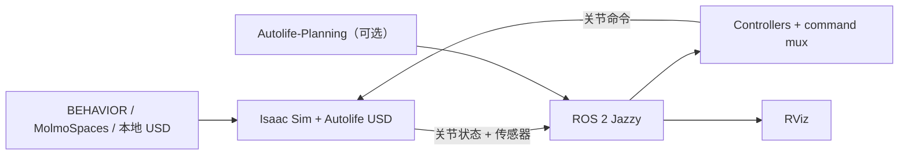

# Autolife_Sim

[English](README.md)


<p align="center">
  
</p>

Autolife_Sim 是 Autolife 机器人的 ROS 2 + Isaac Sim 仿真工作空间。它可以把
机器人加载到 BEHAVIOR-1K、MolmoSpaces 或最小桌面场景中，并将仿真关节和
传感器连接到 ROS 2 controllers、RViz，以及可选的 Autolife-Planning。

## 主要功能

- 使用一个 `autolife_sim` Conda 环境运行 Isaac Sim 5.1、OmniGibson、
  BEHAVIOR-1K 和 MolmoSpaces。
- BEHAVIOR、MolmoSpaces 和本地 USD 共用同一个仿真启动入口。
- 提供关节状态、关节命令、相机、LiDAR、IMU 和 TF 的 ROS 2 bridge。
- 提供带命令仲裁和运行时检查的 ROS-native controllers。
- 可选接入基于 ROS 2 actions 的 Autolife-Planning。
- 依赖、缓存、资产和配置默认使用仓库相对路径。

## 系统架构



仿真环境使用 Python 3.11；controllers 和 RViz 使用系统 ROS 2 Jazzy 的
Python 3.12。两侧通过 DDS 通信，不应在同一个终端混合 Python 路径。

## 环境要求

| 组件 | 已验证版本 |
| --- | --- |
| Ubuntu | 24.04 |
| ROS 2 | Jazzy |
| 仿真环境 Python | 3.11 |
| Isaac Sim | 5.1.0 |
| OmniGibson | 3.8.0 |
| BDDL | 3.7.0 |
| BEHAVIOR-1K | commit `8579326f8a9719fe7a261f69ab0f27d545ac38a9` |
| MolmoSpaces resource manager | `0.0.1b4` |

还需要 Isaac Sim 支持的 NVIDIA GPU、Git 和 Conda。BEHAVIOR 与
MolmoSpaces 数据集需要单独下载，不会提交到本仓库。

## 安装

克隆仓库。下面的目录名只是推荐值；脚本会根据自身位置自动确定仓库根目录。

```bash
git clone https://github.com/Jiaxuan0Lin/Autolife_Sim.git
cd Autolife_Sim
```

创建统一的仿真环境：

```bash
scripts/setup_autolife_sim_env.sh
```

脚本会把已验证的 BEHAVIOR-1K 版本检出到
`.deps/BEHAVIOR-1K`，调用其官方安装器，然后安装
`requirements/autolife_sim.txt` 中固定的 MolmoSpaces 覆盖依赖。默认安装不会
隐式复用本机已有环境，以保证结果确定；需要迁移旧环境时显式指定来源：

```bash
AUTOLIFE_SIM_CLONE_FROM=my_existing_env scripts/setup_autolife_sim_env.sh
```

上游安装器会显示 NVIDIA 和 BEHAVIOR 数据集许可。接受前请阅读官方
[BEHAVIOR-1K 安装说明](https://behavior.stanford.edu/getting_started/installation.html)。
阅读并同意后，如需非交互式安装，可给脚本添加 `--accept-licenses`。

在系统 ROS 2 终端编译工作空间：

```bash
source /opt/ros/jazzy/setup.bash
rosdep install --from-paths src --ignore-src -r -y
colcon build --symlink-install
source install/setup.bash
```

下载当前配置所需的 MolmoSpaces 场景资产：

```bash
source scripts/activate_autolife_sim.sh
python src/autolife_simulation/scripts/download_molmospace_scene.py
```

下载缓存默认位于 `.cache/molmospaces`，稳定资产视图位于
`src/asset/usd/molmospaces`。二者都从仓库根目录解析，也可以通过命令行参数覆盖。

## 快速开始

仿真和系统 ROS 2 应分别在不同终端运行。

### 1. 启动仿真

```bash
source scripts/activate_autolife_sim.sh
python src/autolife_simulation/scripts/start_autolife_simulation.py \
  --scene-model molmospace_scene \
  --steps -1
```

使用 `--scene-model` 切换场景：

| 参数值 | 场景来源 |
| --- | --- |
| `molmospace_scene` | 配置的 MolmoSpaces 场景 |
| `desk` | 本地桌面场景 |
| `Wainscott_0_int` 或其他模型名 | 通过 OmniGibson 加载的 BEHAVIOR-1K 场景 |

服务器运行时可加 `--headless`；完整参数见 `--help`。

### 2. 启动 ROS 2 controllers

```bash
source /opt/ros/jazzy/setup.bash
source install/setup.bash
ros2 launch autolife_control controllers.launch.py
```

### 3. 查看传感器

```bash
source /opt/ros/jazzy/setup.bash
source install/setup.bash
rviz2 -d install/autolife_sensors/share/autolife_sensors/rviz/autolife_sensors.rviz
```

需要验证运行状态时，可以执行：

```bash
python3 src/autolife_control/test/controller_test_runner.py --interactive
python3 src/autolife_sensors/test/sensor_test_runner.py
```

## 可选 Planning Bridge

Autolife-Planning 使用原生规划扩展和系统 ROS Python ABI，因此仍保留为独立的
可选环境。激活其环境后，在仿真和 controllers 已运行的情况下启动 bridge：

```bash
source /opt/ros/jazzy/setup.bash
source install/setup.bash
ros2 launch autolife_planning_bridge planning.launch.py
```

只有当 planner 不在当前环境中时，才需要设置 `AUTOLIFE_PLANNING_ROOT`、
`AUTOLIFE_PLANNING_PYTHON_SITE` 或 `AUTOLIFE_PLANNING_PYTHON`。详细说明见
[planning bridge 文档](src/autolife_planning_bridge/README.md)。

## 配置文件

| 文件 | 用途 |
| --- | --- |
| `src/autolife_simulation/config/molmospace_scene.json` | MolmoSpaces 资产、出生点、物理和交互参数 |
| `src/autolife_simulation/config/desk.json` | 本地桌面场景配置 |
| `src/autolife_simulation/config/autolife.json` | 机器人 drive 和控制配置 |
| `src/autolife_control/launch/controllers.launch.py` | ROS 2 controller 启动配置 |
| `src/autolife_sensors/test/sensor_test_config.yaml` | 传感器运行时验证配置 |


## 仓库结构

```text
Autolife_Sim/
├── requirements/                 # 固定的仿真覆盖依赖
├── scripts/                      # 环境安装和激活脚本
├── src/
│   ├── asset/                    # 机器人、传感器和本地场景资产
│   ├── autolife_description/     # URDF/Xacro 和可视化
│   ├── autolife_control/         # Controllers 和 command mux
│   ├── autolife_hardware/        # ros2_control hardware interface
│   ├── autolife_planning_bridge/ # 可选 planning actions
│   ├── autolife_planning_msgs/   # Planning action 定义
│   ├── autolife_sensors/         # 传感器验证和 RViz
│   └── autolife_simulation/      # Isaac Sim/OmniGibson 集成
└── README.md
```

各 ROS 包的接口见
[autolife_simulation](src/autolife_simulation/README.md)、
[autolife_control](src/autolife_control/README.md) 和
[autolife_sensors](src/autolife_sensors/README.md)。

## 许可证与上游项目

本仓库使用 [Apache License 2.0](LICENSE)。外部仿真器、数据集和资产保留各自的
许可证：

- [NVIDIA Isaac Sim](https://docs.isaacsim.omniverse.nvidia.com/)
- [BEHAVIOR-1K / OmniGibson](https://github.com/StanfordVL/BEHAVIOR-1K)
- [MolmoSpaces](https://github.com/allenai/molmospaces)
- [Autolife-Planning](https://github.com/AdaCompNUS/Autolife-Planning)
